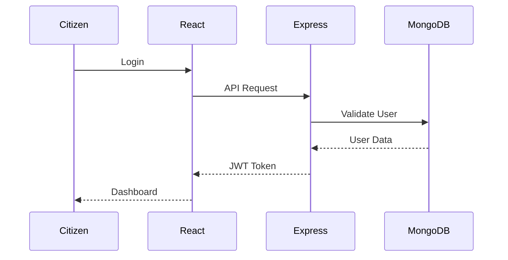
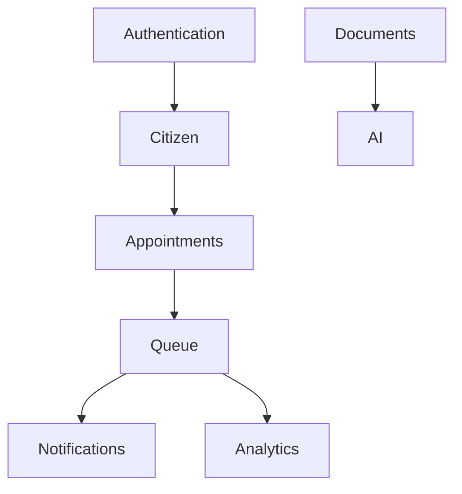
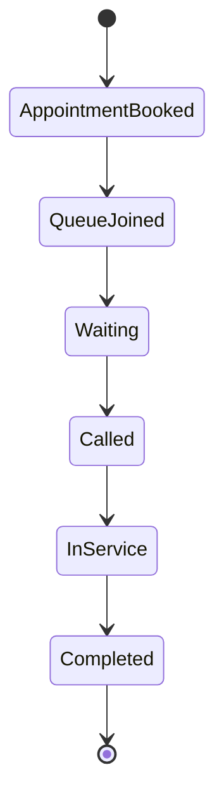
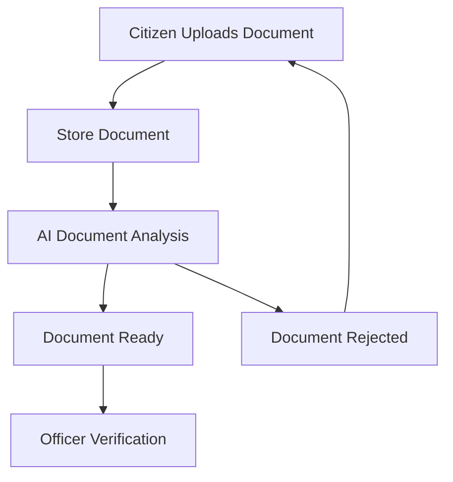
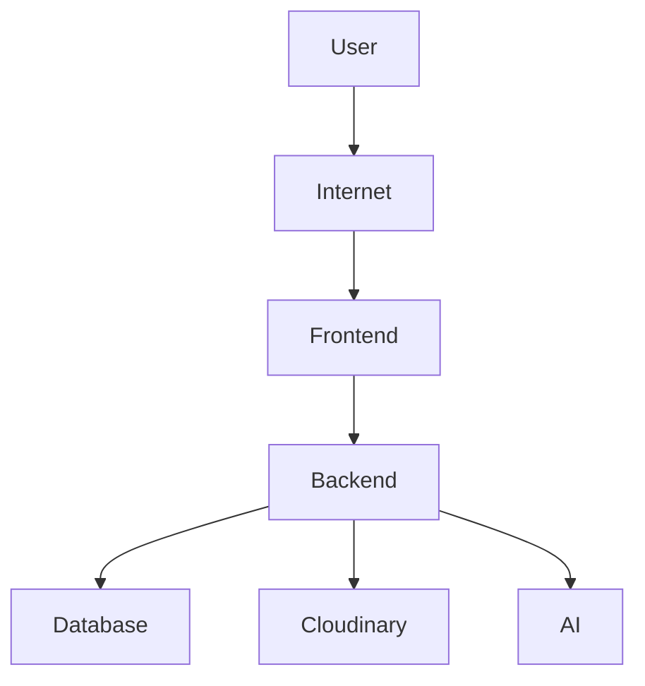

# System Architecture

**Project Name:** SevaFlow

**Version:** 1.0

**Author:** Janisha Narang

**Date:** July 2026

---

# 1. Introduction

This document describes the overall architecture of SevaFlow. It explains how different components of the system interact with each other, how data flows through the application, and how the technology stack is organized.

The architecture follows a modular client-server design, ensuring scalability, maintainability, and ease of future expansion.

---

````markdown
# 2. Architecture Overview

SevaFlow follows a three-tier architecture:

1. Presentation Layer
2. Application Layer
3. Data Layer

## High-Level Architecture Diagram

```mermaid
graph TD

A[Citizen] --> B[React Frontend]
B --> C[Express Backend]

C --> D[Authentication Module]
C --> E[Appointment Module]
C --> F[Queue Module]
C --> G[Document Module]
C --> H[AI Module]
C --> I[Notification Module]

D --> J[(MongoDB Atlas)]
E --> J
F --> J
G --> K[Cloudinary]
H --> L[AI Services]

F --> M[Socket.IO]

M --> B

---

````markdown
# 3. Technology Stack

| Layer | Technology |
|--------|------------|
| Frontend | React (Vite) |
| UI | Tailwind CSS |
| Components | ShadCN UI |
| Backend | Node.js |
| Framework | Express.js |
| Database | MongoDB Atlas |
| Authentication | JWT + Refresh Tokens |
| Password Security | bcrypt |
| File Storage | Cloudinary |
| Real-Time | Socket.IO |
| Charts | Recharts |

## Technology Architecture Diagram

```mermaid
graph LR

A["React + Vite"] --> D["Express.js"]
B["Tailwind CSS"] --> A
C["ShadCN UI"] --> A

D --> E["Node.js"]
D --> F[("MongoDB Atlas")]
D --> G["Cloudinary"]
D --> H["Socket.IO"]
D --> I["JWT Authentication"]
D --> J["AI Services"]
```

---

# 4. High-Level System Flow

## Request Flow Diagram



---

# 5. Module Architecture

The system consists of the following independent modules:

- Authentication Module
- User Management Module
- Government Services Module
- Office Management Module
- Appointment Module
- Queue Management Module
- Document Management Module
- Notification Module
- AI Module
- Analytics Module
- Administration Module

Each module is independently maintainable and communicates through well-defined APIs.

## Module Dependency Diagram



---

# 6. Authentication Flow

```
Login

↓

Validate Credentials

↓

Generate Access Token

↓

Generate Refresh Token

↓

Store Refresh Token

↓

Return Tokens

↓

Protected Routes

↓

Token Refresh (When Required)
```

---

# 7. Queue Management Flow

```
Book Appointment

↓

Generate Queue Token

↓

Join Queue

↓

Real-Time Updates

↓

Officer Calls Citizen

↓

Service Completed

↓

Queue Updated
```

## Queue Lifecycle



---

# 8. Document Flow

```
Citizen Uploads Document

↓

Cloudinary Storage

↓

Document Metadata Stored

↓

AI Readiness Check

↓

Officer Verification

↓

Approval / Rejection
```

---

# 9. Notification Flow

```
Appointment Booked

↓

Notification Service

↓

Socket.IO

↓

Citizen Dashboard

↓

Browser Notification
```

---

# 10. AI Service Flow

```
Citizen Request

↓

AI Processing

↓

Document Analysis

↓

Recommendations

↓

Response Returned
```

## AI Processing Flow



---

# 11. Database Communication

All data interactions follow this sequence:

```
Frontend

↓

Express Route

↓

Controller

↓

Service

↓

MongoDB

↓

Response
```

---

# 12. Security Architecture

Security mechanisms include:

- JWT Authentication
- Refresh Tokens
- Password Hashing
- Protected Routes
- Role-Based Access Control
- Secure File Upload
- Input Validation
- Rate Limiting

---

# 13. Scalability Considerations

The architecture is designed to support:

- Multiple government departments
- Multiple offices
- Thousands of concurrent users
- Additional AI services
- Future mobile application
- Cloud deployment

---

# 14. Future Expansion

The architecture allows future integration of:

- React Native Mobile App
- DigiLocker
- Government APIs
- OCR Services
- AI Recommendation Engine
- Digital Payments
- WhatsApp Notifications


---
# Deployment Architecture



# 15. Conclusion

The modular architecture of SevaFlow ensures that each component remains independent, scalable, and maintainable.

This design enables rapid development, simplified testing, and seamless future enhancements while providing a secure and efficient platform for citizen service management.