# System Architecture

**Project Name:** SevaFlow

**Version:** 1.0

**Author:** Janisha Narang

**Date:** July 2026

---

# 1. Introduction

This document describes the overall architecture of SevaFlow. It explains how different components of the system interact with each other, how data flows through the application, and how the technology stack is organized.

The architecture follows a modular client-server design, ensuring scalability, maintainability, and ease of future expansion.

---

# 2. Architecture Overview

SevaFlow follows a modern three-tier architecture consisting of:

1. Presentation Layer
2. Application Layer
3. Data Layer

## High-Level Architecture Diagram

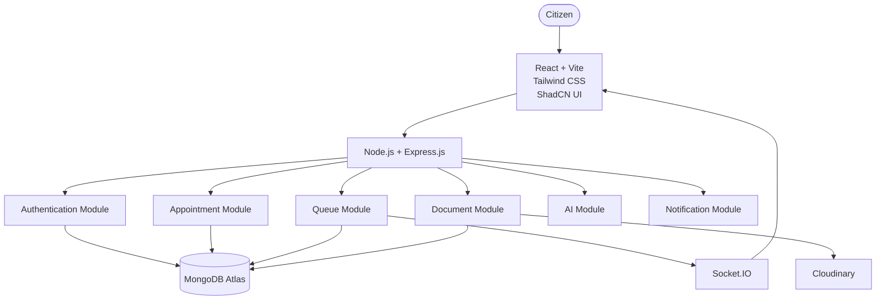

---

# 3. Technology Stack

| Layer | Technology |
|--------|------------|
| Frontend | React (Vite) |
| UI | Tailwind CSS |
| Components | ShadCN UI |
| Backend | Node.js |
| Framework | Express.js |
| Database | MongoDB Atlas |
| Authentication | JWT + Refresh Tokens |
| Password Security | bcrypt |
| File Storage | Cloudinary |
| Real-Time | Socket.IO |
| Charts | Recharts |

## Technology Architecture Diagram

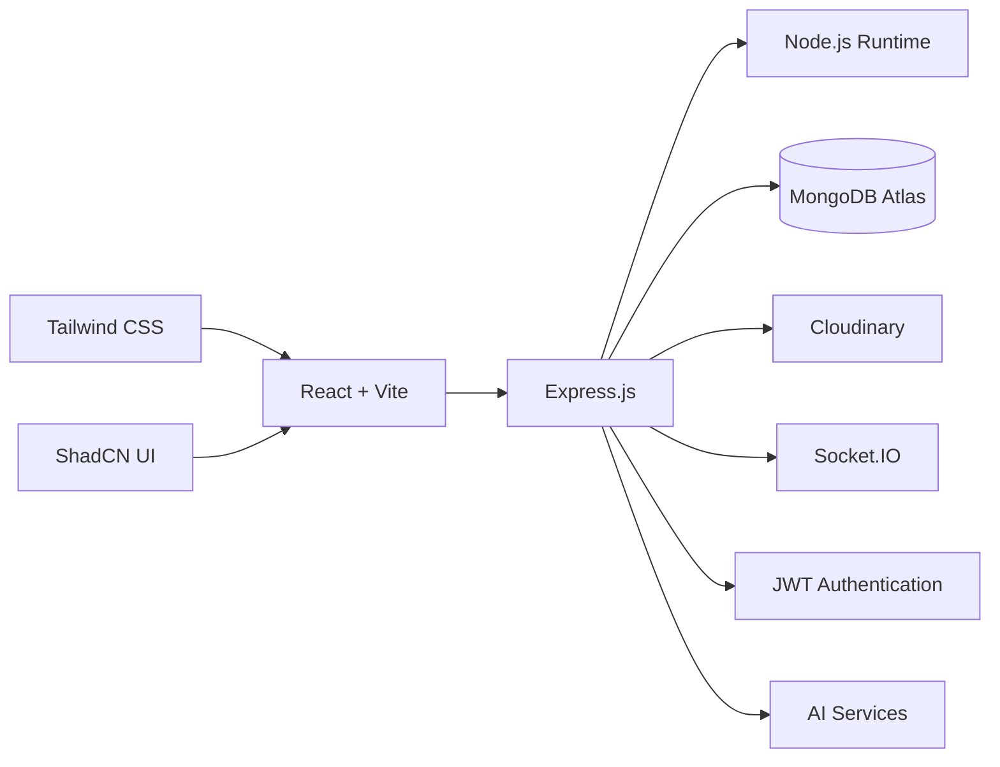

---

# 4. High-Level System Flow

The following diagram illustrates how a request travels through the SevaFlow platform.

## Request Flow Diagram

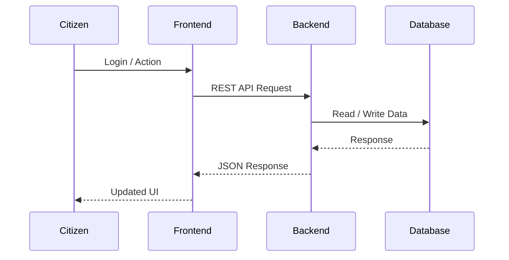

---

# 5. Module Architecture

The system consists of independent and reusable modules.

- Authentication Module
- User Management Module
- Government Services Module
- Office Management Module
- Appointment Module
- Queue Management Module
- Document Management Module
- Notification Module
- AI Module
- Analytics Module
- Administration Module

Each module communicates through secured REST APIs and follows a modular architecture.

## Module Dependency Diagram

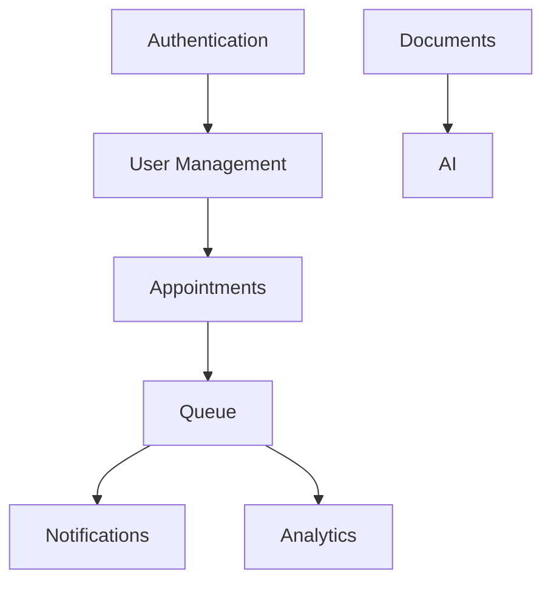

---

# 6. Authentication Flow

Authentication is implemented using JWT Access Tokens and Refresh Tokens.

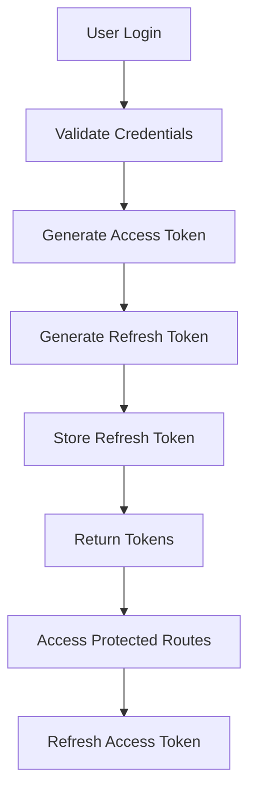

---

# 7. Queue Management Flow

The Queue Management Engine handles appointments, token generation, and real-time updates.

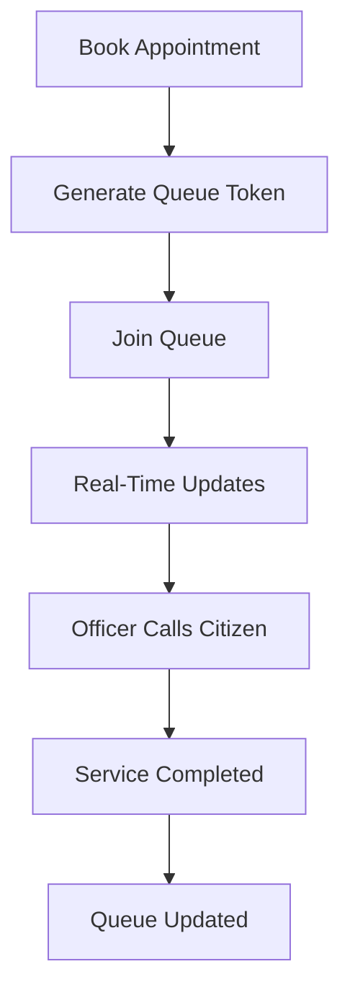

## Queue Lifecycle

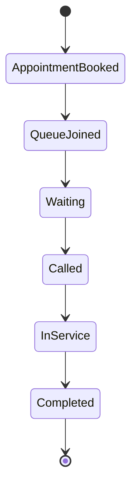

---

# 8. Document Flow

The Document Management module allows citizens to upload required documents before visiting the government office. Uploaded documents are securely stored in Cloudinary and can be verified by officers after AI-based pre-validation.

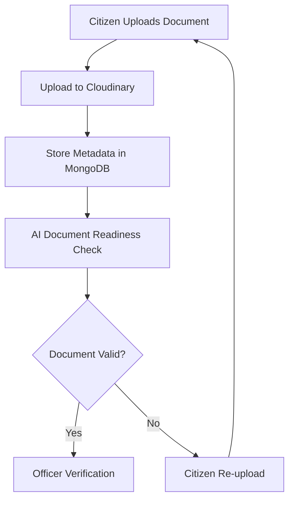

---

# 9. Notification Flow

The Notification Module ensures that citizens remain informed throughout their service journey using Socket.IO for real-time updates.

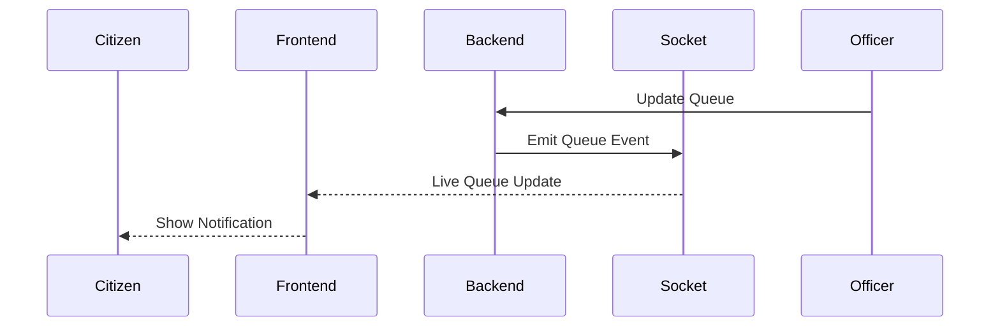

---

# 10. AI Service Flow

SevaFlow integrates AI services to improve document verification, answer citizen queries, and provide intelligent recommendations.

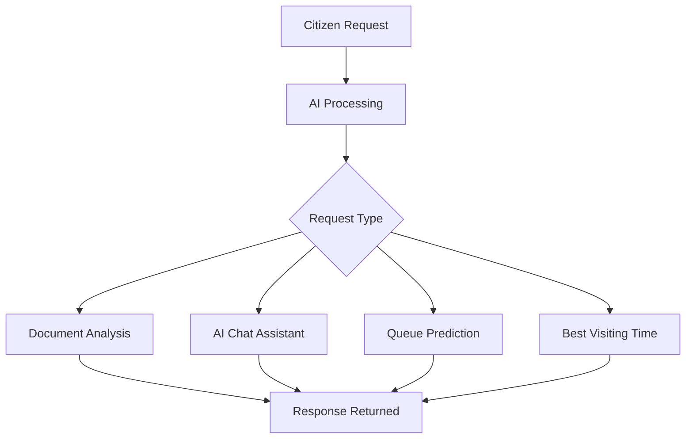

## AI Processing Flow

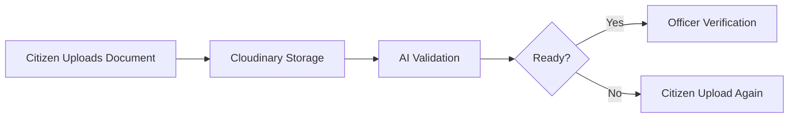

---

# 11. Database Communication

Every request follows a layered architecture to keep the codebase modular and maintainable.

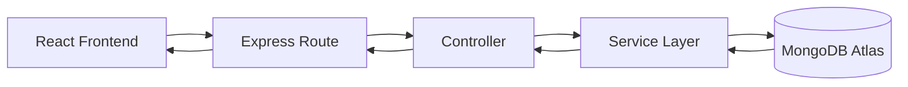

---

# 12. Security Architecture

Security is implemented at multiple levels of the application.

- JWT Authentication
- Refresh Tokens
- bcrypt Password Hashing
- Protected APIs
- Role-Based Access Control
- Secure File Upload
- Input Validation
- Rate Limiting
- Helmet Middleware
- CORS Protection

## Security Flow

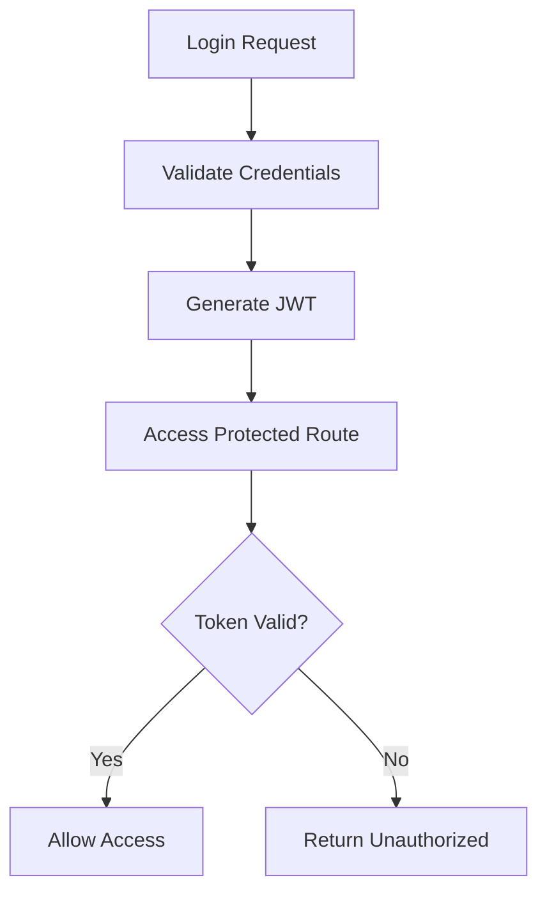

---

# 13. Scalability Considerations

The architecture is designed to support future expansion without major structural changes.

- Multiple Government Departments
- Multiple Offices
- Thousands of Concurrent Users
- Cloud Deployment
- Horizontal Backend Scaling
- AI Service Expansion
- Mobile Application Support
- Future Microservices Migration

---

# 14. Future Expansion

The modular architecture allows seamless integration of future technologies.

- React Native Mobile Application
- DigiLocker Integration
- Government APIs
- OCR-Based Document Verification
- AI Recommendation Engine
- Digital Payments
- WhatsApp Notifications
- SMS Notifications
- Voice Assistant
- Multilingual Support

## Deployment Architecture

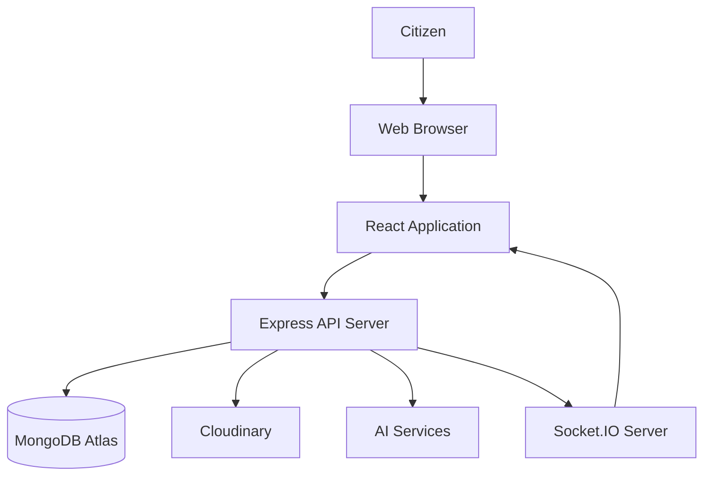

---

# 15. Conclusion

The architecture of **SevaFlow** follows a modular, scalable, and secure client-server model that separates presentation, business logic, and data storage into independent layers.

By integrating **React**, **Node.js**, **Express.js**, **MongoDB Atlas**, **Socket.IO**, **Cloudinary**, and **AI-powered services**, the platform provides a robust foundation for digital government service delivery.

The modular design simplifies development, testing, deployment, and future enhancements while ensuring maintainability and scalability as the platform grows to support additional government departments, mobile applications, and intelligent automation.