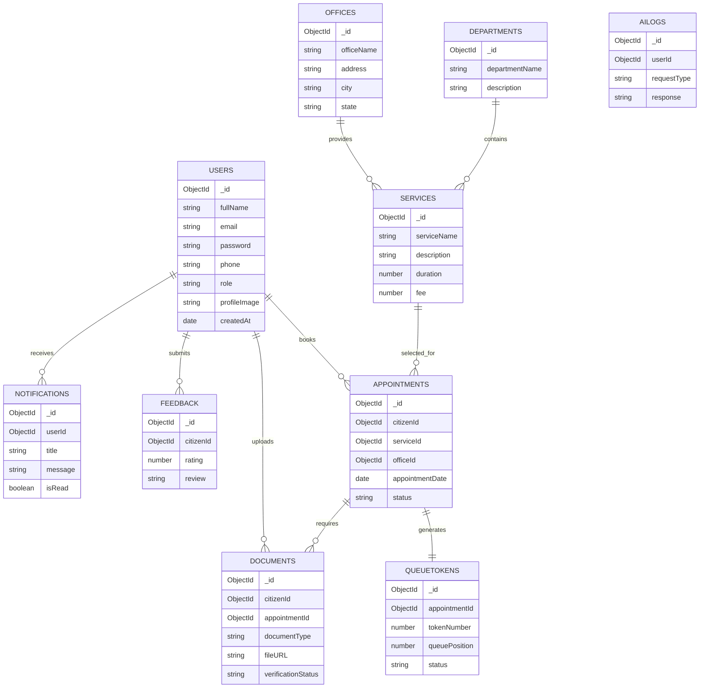

# Database Design

**Project Name:** SevaFlow

**Version:** 1.0

**Author:** Janisha Narang

**Date:** July 2026

---

# 1. Introduction

This document defines the database architecture of SevaFlow. The platform uses MongoDB Atlas as its primary NoSQL database. Collections are designed to ensure scalability, flexibility, and efficient querying while supporting multiple government offices, services, and user roles.

---

# 2. Database Technology

| Property | Value |
|----------|--------|
| Database | MongoDB Atlas |
| ORM | Mongoose |
| Database Type | NoSQL |
| Primary Key | ObjectId |
| File Storage | Cloudinary |
| Relationships | Reference-based |

---

# 3. Database Collections

The system consists of the following collections:

- Users
- Departments
- Offices
- Services
- Appointments
- Queue Tokens
- Documents
- Notifications
- Feedback
- AI Logs
- Audit Logs

---

# 4. Entity Relationship Diagram

---

# 5. Collection Design

## Users Collection

Stores all registered users.

### Fields

| Field | Type | Required |
|---------|------|----------|
| fullName | String | Yes |
| email | String | Yes |
| password | String | Yes |
| phone | String | Yes |
| role | String | Yes |
| profileImage | String | No |
| refreshToken | String | No |
| createdAt | Date | Yes |

---

## Departments Collection

Stores all government departments.

Fields

- departmentName
- description

---

## Offices Collection

Stores office information.

Fields

- officeName
- address
- city
- state
- pincode
- latitude
- longitude

---

## Services Collection

Stores government services.

Fields

- serviceName
- description
- processingTime
- fee
- requiredDocuments

---

## Appointments Collection

Stores citizen appointments.

Fields

- citizenId
- officeId
- serviceId
- appointmentDate
- appointmentTime
- status

---

## Queue Tokens Collection

Stores queue information.

Fields

- appointmentId
- tokenNumber
- queuePosition
- estimatedWaitTime
- status

---

## Documents Collection

Stores uploaded documents.

Fields

- citizenId
- appointmentId
- documentType
- cloudinaryURL
- aiReadinessScore
- verificationStatus

---

## Notifications Collection

Stores notifications.

Fields

- userId
- title
- message
- type
- isRead
- createdAt

---

## Feedback Collection

Stores citizen reviews.

Fields

- citizenId
- officerId
- rating
- review
- createdAt

---

## AI Logs Collection

Stores AI interactions.

Fields

- userId
- requestType
- prompt
- response
- createdAt

---

## Audit Logs Collection

Stores system activities.

Fields

- userId
- action
- module
- ipAddress
- createdAt

---

# 6. Relationships

| Collection | Relationship |
|------------|--------------|
| User → Appointment | One to Many |
| User → Documents | One to Many |
| User → Feedback | One to Many |
| Department → Service | One to Many |
| Office → Services | One to Many |
| Appointment → Queue Token | One to One |
| Appointment → Documents | One to Many |

---

# 7. Indexing Strategy

The following indexes will improve query performance.

- email
- phone
- appointmentDate
- queuePosition
- serviceId
- officeId
- citizenId

---

# 8. Data Validation

Validation rules include:

- Unique email
- Strong password
- Required phone number
- Valid appointment date
- Valid role
- Allowed file formats
- Maximum upload size

---

# 9. Future Database Enhancements

Future versions may include:

- Redis Caching
- ElasticSearch
- Vector Database for AI
- Event Logging
- Database Sharding

---

# 10. Conclusion

The MongoDB database architecture is designed to support a scalable, secure, and maintainable platform. The schema structure ensures efficient management of users, appointments, queues, documents, notifications, and AI-assisted services while allowing future expansion with minimal structural changes.