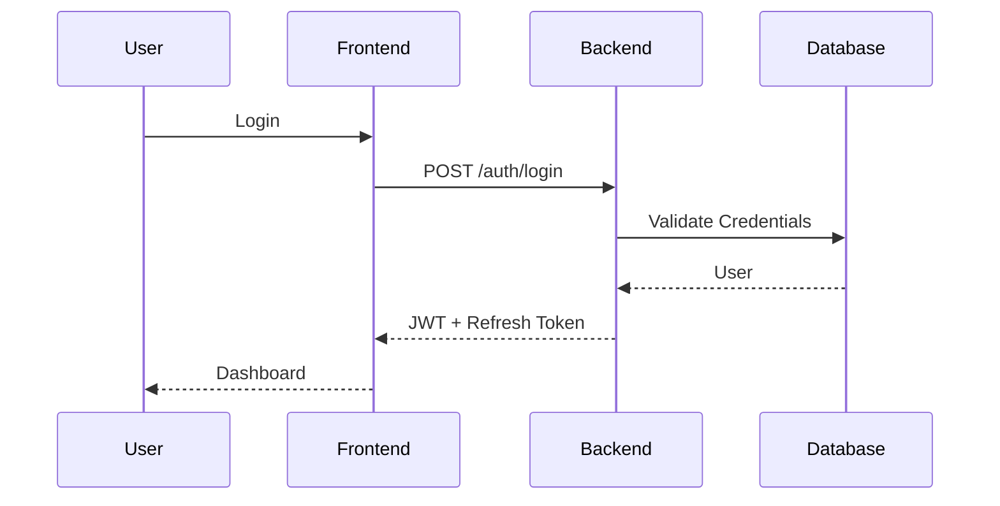

# API Documentation

**Project Name:** SevaFlow

**Version:** 1.0

**Author:** Janisha Narang

**Date:** July 2026

---

# 1. Introduction

This document defines the REST API endpoints used in SevaFlow. The APIs follow RESTful principles and exchange data in JSON format.

Base URL

```
http://localhost:5000/api/v1
```

Production URL

```
https://api.sevaflow.com/api/v1
```

---

# 2. Authentication APIs

| Method | Endpoint | Description |
|---------|----------|-------------|
| POST | /auth/register | Register new user |
| POST | /auth/login | Login user |
| POST | /auth/logout | Logout |
| POST | /auth/refresh-token | Refresh JWT |
| POST | /auth/forgot-password | Forgot password |
| POST | /auth/reset-password | Reset password |
| GET | /auth/me | Current logged-in user |

---

# 3. User APIs

| Method | Endpoint |
|---------|-----------|
| GET | /users/profile |
| PUT | /users/profile |
| DELETE | /users/profile |
| POST | /users/profile-image |

---

# 4. Department APIs

| Method | Endpoint |
|---------|----------|
| GET | /departments |
| GET | /departments/:id |
| POST | /departments |
| PUT | /departments/:id |
| DELETE | /departments/:id |

---

# 5. Office APIs

| Method | Endpoint |
|---------|----------|
| GET | /offices |
| GET | /offices/:id |
| POST | /offices |
| PUT | /offices/:id |
| DELETE | /offices/:id |

---

# 6. Government Service APIs

| Method | Endpoint |
|---------|----------|
| GET | /services |
| GET | /services/:id |
| POST | /services |
| PUT | /services/:id |
| DELETE | /services/:id |

---

# 7. Appointment APIs

| Method | Endpoint |
|---------|----------|
| GET | /appointments |
| GET | /appointments/:id |
| POST | /appointments |
| PUT | /appointments/:id |
| DELETE | /appointments/:id |
| GET | /appointments/history |

---

# 8. Queue APIs

| Method | Endpoint |
|---------|----------|
| POST | /queue/join |
| POST | /queue/leave |
| GET | /queue/status |
| GET | /queue/live |
| PUT | /queue/call-next |
| PUT | /queue/complete |

---

# 9. Document APIs

| Method | Endpoint |
|---------|----------|
| POST | /documents/upload |
| GET | /documents |
| GET | /documents/:id |
| DELETE | /documents/:id |

---

# 10. Notification APIs

| Method | Endpoint |
|---------|----------|
| GET | /notifications |
| PUT | /notifications/read |
| DELETE | /notifications/:id |

---

# 11. Feedback APIs

| Method | Endpoint |
|---------|----------|
| POST | /feedback |
| GET | /feedback |
| GET | /feedback/:id |

---

# 12. AI APIs

| Method | Endpoint |
|---------|----------|
| POST | /ai/chat |
| POST | /ai/document-analysis |
| POST | /ai/queue-prediction |
| POST | /ai/recommendation |

---

# 13. Admin APIs

| Method | Endpoint |
|---------|----------|
| GET | /admin/dashboard |
| GET | /admin/users |
| GET | /admin/offices |
| GET | /admin/services |
| GET | /admin/reports |

---

# 14. Super Admin APIs

| Method | Endpoint |
|---------|----------|
| GET | /super-admin/dashboard |
| GET | /super-admin/system-health |
| GET | /super-admin/audit-logs |
| POST | /super-admin/create-admin |
| DELETE | /super-admin/users/:id |

---

# 15. Standard Response Format

## Success Response

```json
{
  "success": true,
  "message": "Operation completed successfully",
  "data": {}
}
```

---

## Error Response

```json
{
  "success": false,
  "message": "Something went wrong",
  "error": {}
}
```

---

# 16. HTTP Status Codes

| Code | Meaning |
|------|---------|
| 200 | OK |
| 201 | Created |
| 400 | Bad Request |
| 401 | Unauthorized |
| 403 | Forbidden |
| 404 | Not Found |
| 409 | Conflict |
| 422 | Validation Error |
| 500 | Internal Server Error |

---

# 17. Authentication Flow



---

# 18. API Folder Structure

```
server/

src/

routes/

controllers/

middlewares/

services/

models/

utils/
```

---

# 19. Future APIs

- DigiLocker Integration
- Aadhaar Verification
- Payment Gateway
- SMS Gateway
- WhatsApp API
- OCR APIs
- Government APIs

---

# 20. Conclusion

The API architecture of SevaFlow follows RESTful standards and is designed to be scalable, secure, and maintainable. Every endpoint is organized by module, enabling easy development, testing, and future integration with mobile applications and external government systems.