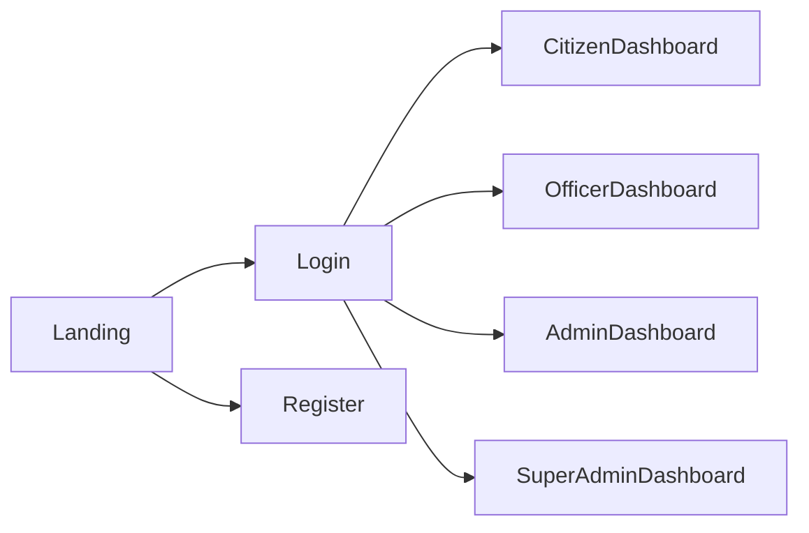
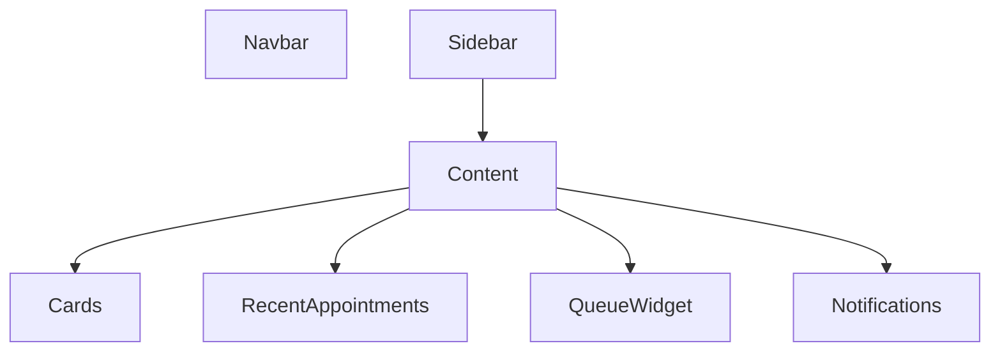

# UI Planning

**Project Name:** SevaFlow

**Version:** 1.0

**Author:** Janisha Narang

**Date:** July 2026

---

# 1. Introduction

This document defines the user interface planning for SevaFlow. It covers design principles, layouts, navigation, pages, reusable components, responsiveness, accessibility, and design system guidelines.

The frontend will be developed using React (Vite), Tailwind CSS, and ShadCN UI.

---

# 2. Design Principles

The interface should follow these principles:

- Simple and intuitive
- Minimal clicks
- Mobile-first design
- Accessibility-friendly
- Fast loading
- Clean government-grade interface
- Consistent spacing
- Reusable components

---

# 3. Design System

## Color Palette

| Purpose | Color |
|----------|--------|
| Primary | #2563EB |
| Secondary | #0F172A |
| Success | #16A34A |
| Warning | #F59E0B |
| Error | #DC2626 |
| Background | #F8FAFC |
| Card | #FFFFFF |
| Border | #E2E8F0 |
| Text | #1E293B |

---

## Typography

| Element | Font |
|----------|------|
| Headings | Inter Bold |
| Body | Inter Regular |
| Buttons | Inter Medium |
| Labels | Inter Medium |

---

## Border Radius

- Cards → 16px
- Buttons → 10px
- Inputs → 10px
- Dialogs → 18px

---

## Spacing System

Use an **8px spacing system** throughout the application.

Examples:

- 8px
- 16px
- 24px
- 32px
- 48px

---

# 4. Application Navigation

---

# 5. Public Pages

- Landing Page
- Login
- Register
- Forgot Password
- Reset Password
- About
- Contact

---

# 6. Citizen Portal

## Pages

- Dashboard
- My Profile
- Appointments
- Queue Status
- Documents
- Notifications
- AI Assistant
- Feedback
- Settings

---

## Dashboard Layout

---

# 7. Officer Dashboard

Pages

- Dashboard
- Current Queue
- Citizen Verification
- Documents
- Reports
- Settings

---

# 8. Reception Dashboard

Pages

- Dashboard
- QR Scanner
- Walk-in Registration
- Token Generator
- Queue Status

---

# 9. Administrator Dashboard

Pages

- Dashboard
- Offices
- Departments
- Services
- Officers
- Analytics
- Reports

---

# 10. Super Administrator Dashboard

Pages

- Platform Dashboard
- User Management
- Role Management
- Audit Logs
- System Health
- Global Analytics

---

# 11. Reusable Components

The following ShadCN UI components will be used:

- Button
- Card
- Input
- Select
- Table
- Dialog
- Drawer
- Badge
- Avatar
- Alert
- Tooltip
- Tabs
- Calendar
- Dropdown Menu
- Skeleton
- Toast
- Progress
- Command
- Sheet

---

# 12. Forms

Forms should include:

- Client-side validation
- Error messages
- Success messages
- Required field indicators
- Password visibility toggle
- File upload preview

---

# 13. Responsive Design

Breakpoints

| Device | Width |
|---------|-------|
| Mobile | <640px |
| Tablet | 640px–1024px |
| Desktop | >1024px |

The application should be fully responsive.

---

# 14. Accessibility

The application should support:

- Keyboard navigation
- Screen readers
- Focus indicators
- Proper contrast ratio
- Semantic HTML
- ARIA labels

---

# 15. Dark Mode

Future support will include:

- Dark Theme
- System Theme Detection
- User Preference Storage

---

# 16. Animation Guidelines

Animations should be subtle and improve usability.

Recommended:

- Fade In
- Slide Up
- Hover Effects
- Skeleton Loading
- Toast Notifications
- Page Transitions

---

# 17. Icons

Recommended icon library:

- Lucide React

Common icons:

- Home
- User
- Calendar
- Bell
- Search
- File
- Settings
- Shield
- Log Out
- Menu

---

# 18. Future UI Enhancements

- Voice Search
- AI Floating Assistant
- Drag-and-Drop Upload
- Multi-language Toggle
- Government Theme Variants
- Interactive Analytics Dashboard

---

# 19. Conclusion

The UI planning for SevaFlow focuses on creating a modern, responsive, and accessible experience for all stakeholders. By leveraging React, Tailwind CSS, and ShadCN UI, the platform will maintain visual consistency, scalability, and ease of development while providing an intuitive experience for citizens and government officials.