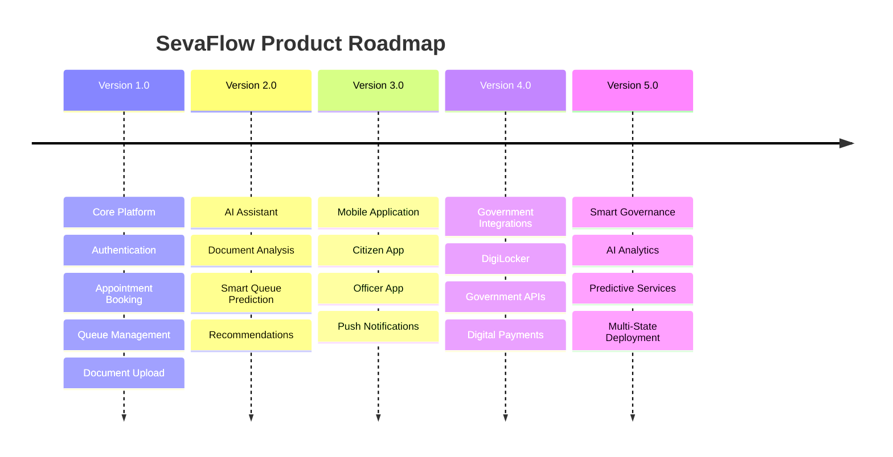
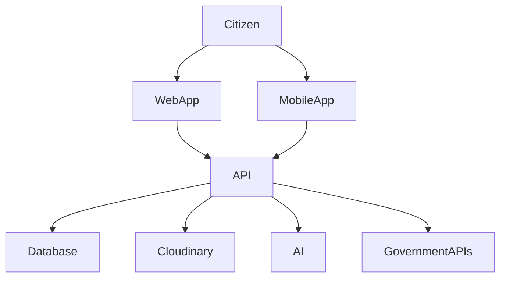

# Future Roadmap

**Project Name:** SevaFlow

**Version:** 1.0

**Author:** Janisha Narang

**Date:** July 2026

---

# 1. Vision

SevaFlow aims to transform how citizens interact with government services by creating a centralized, intelligent, and user-friendly platform for appointments, queue management, document verification, and digital public service delivery.

The long-term vision is to become a scalable digital governance platform capable of supporting multiple departments, cities, and states while reducing waiting time, paperwork, and administrative overhead.

---

# 2. Product Evolution

---

# 3. Phase 1 — Minimum Viable Product (MVP)

### Goal

Develop the first working version of SevaFlow with all essential features.

### Features

- User Authentication
- Citizen Dashboard
- Appointment Booking
- Queue Token Generation
- Live Queue Tracking
- Document Upload
- Notifications
- Officer Dashboard
- Admin Dashboard

---

# 4. Phase 2 — Artificial Intelligence

The second phase introduces intelligent automation.

### Planned Features

- AI Chat Assistant
- AI Document Readiness Check
- Smart Queue Prediction
- Appointment Recommendation
- Frequently Asked Question Assistant

---

# 5. Phase 3 — Mobile Application

Develop dedicated mobile applications.

### Platforms

- Android
- iOS

### Technologies

- React Native
- Expo
- Firebase Push Notifications

### Features

- Digital Queue
- QR Code Check-in
- Push Notifications
- Document Upload
- Appointment Booking

---

# 6. Government Integrations

Future integration with official government systems.

### Planned Integrations

- DigiLocker
- Aadhaar Verification
- PAN Verification
- Digital Signature
- Payment Gateway
- SMS Gateway
- WhatsApp API
- Email Service

---

# 7. AI Roadmap

The AI ecosystem will expand over time.

### Version 1

- AI Chat Assistant

### Version 2

- AI Queue Prediction

### Version 3

- AI Document Validation

### Version 4

- AI Appointment Suggestions

### Version 5

- AI Government Service Recommendation

---

# 8. Analytics Roadmap

Future analytics dashboards will include:

- Daily Visitors
- Queue Analytics
- Waiting Time Analysis
- Service Performance
- Officer Performance
- Citizen Satisfaction
- Peak Hour Analysis
- Department Performance

---

# 9. Security Roadmap

Future security improvements include:

- Two-Factor Authentication
- Biometric Login
- Device Management
- Login History
- Suspicious Activity Detection
- Security Alerts
- Session Monitoring

---

# 10. Cloud Infrastructure Roadmap

Future cloud enhancements include:

- Docker Containers
- Kubernetes
- Redis Cache
- Load Balancer
- CDN
- Auto Scaling
- Multi-region Deployment
- Monitoring Dashboard

---

# 11. Accessibility Roadmap

Future accessibility features include:

- Voice Navigation
- Screen Reader Support
- Regional Language Support
- High Contrast Mode
- Keyboard Navigation
- Font Size Controls

---

# 12. Open Source Roadmap

Future community contributions may include:

- Issue Templates
- Feature Requests
- Community Plugins
- API SDK
- Developer Documentation
- Public REST API

---

# 13. Business Expansion

Potential future use cases:

- Municipal Corporations
- Passport Offices
- RTO Offices
- Hospitals
- Universities
- Courts
- Banks
- Public Service Centers

---

# 14. Long-Term Goals

Within the next few years, SevaFlow aims to:

- Support millions of users
- Integrate with multiple government departments
- Provide multilingual support
- Launch native mobile applications
- Deliver AI-powered public service recommendations
- Become a centralized citizen service platform

---

# 15. Success Metrics

The success of SevaFlow can be measured through:

- Reduced average waiting time
- Increased online appointment adoption
- Faster document verification
- Improved citizen satisfaction
- Reduced paperwork
- Higher government office efficiency
- Increased digital service adoption

---

# 16. Risks & Challenges

Potential challenges include:

- Government API availability
- Data privacy regulations
- Scalability during peak usage
- AI accuracy
- User adoption
- Infrastructure costs
- Integration complexity

---

# 17. Future Technology Stack

| Category | Technology |
|----------|------------|
| Web | React + Vite |
| Mobile | React Native + Expo |
| Backend | Node.js + Express.js |
| Database | MongoDB Atlas |
| Cache | Redis |
| File Storage | Cloudinary |
| Authentication | JWT + Refresh Tokens |
| Real-time | Socket.IO |
| AI | OpenAI / Gemini |
| Deployment | Docker + Kubernetes |
| Monitoring | Grafana + Prometheus |

---

# 18. Future Architecture

---

# 19. Product Vision Statement

> "SevaFlow envisions a future where every citizen can access government services digitally with minimal waiting time, transparent processes, intelligent assistance, and a seamless user experience."

---

# 20. Conclusion

The roadmap outlines the long-term direction of SevaFlow beyond its initial release. By continuously expanding AI capabilities, integrating with government platforms, supporting mobile devices, and enhancing accessibility, SevaFlow aims to become a scalable and future-ready digital governance platform.

This roadmap serves as a strategic guide for future development while ensuring that the platform remains adaptable to technological advancements and evolving citizen needs.